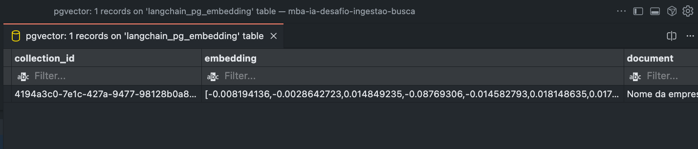
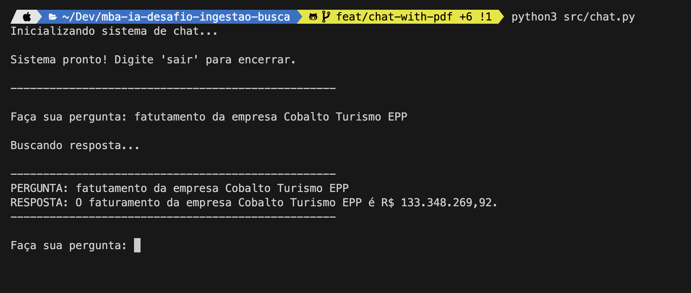

# Desafio MBA Engenharia de Software com IA - Full Cycle

Esta solução implementa um sistema de ingestão de documentos PDF e um chat com busca semântica utilizando modelos Gemini da Google e banco de dados PostgreSQL com pgvector.

## Pré-requisitos

- Python 3.10+
- Docker e Docker Compose
- Chave de API do Google AI Studio (Gemini)

## Configuração

1. Clone o repositório.
2. Crie um arquivo `.env` baseado no `.env.example`:
   ```bash
   cp .env.example .env
   ```
   Edite o arquivo `.env` e adicione sua `GOOGLE_API_KEY`.

3. Instale as dependências:
   ```bash
   python -m venv venv
   source venv/bin/activate  # Linux/Mac
   # venv\Scripts\activate  # Windows
   pip install -r requirements.txt
   ```

## Execução

### 1. Iniciar o Banco de Dados

Inicie o PostgreSQL com a extensão pgvector:

```bash
docker-compose up -d
```

### 2. Ingestão de Dados

Execute o script de ingestão para processar o PDF (padrão: `document.pdf`) e salvar os embeddings no banco:

```bash
python src/ingest.py
```

### 3. Executar o Chat

Inicie a interface de chat interativa:

```bash
python src/chat.py
```

## Estrutura do Projeto

- `src/ingest.py`: Script de processamento e ingestão de documentos.
- `src/search.py`: Lógica de busca semântica e geração de respostas.
- `src/chat.py`: Interface de linha de comando (CLI) para interação.

## Screenshots


